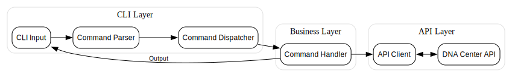

# Contributing to catalysh

Thank you for your interest in contributing to catalysh! This document provides guidelines and information for contributors.

## Project Structure

```
catalysh/
├── src/
│   ├── api/                    # API interaction layer
│   │   ├── authentication/     # Auth handling
│   │   └── endpoints/          # API endpoint implementations
│   ├── app/                    # Application core
│   │   ├── auth_storage.rs     # Secure credential storage
│   │   └── config.rs           # Configuration management
│   ├── handlers/               # Command handlers
│   │   ├── show/              # Show command implementations
│   │   └── config/            # Config command implementations
│   └── main.rs                 # Application entry point
├── Cargo.toml                  # Project dependencies
└── README.md                   # Project documentation
```

## Development Setup

1. **Environment Setup**
```bash
# Clone the repository
git clone https://github.com/yourusername/catalysh.git
cd catalysh

# Install Rust if needed
curl --proto '=https' --tlsv1.2 -sSf https://sh.rustup.rs | sh

# Build the project
cargo build
```

2. **Development Dependencies**
- Rust 1.56 or newer
- SQLite development libraries
- OpenSSL development libraries

## Command Flow Architecture





```

## Adding New Commands

### 1. Command Structure Overview
Commands in catalysh follow a modular structure with three main types:
- Show commands (data display)
- App commands (application control)
- Config commands (configuration REPL)

### 2. Command Implementation Steps

#### Basic Command Structure
```rust

// src/commands/your_category/your_command.rs
pub struct YourCommand {
    args: YourCommandArgs,
}

#[derive(Args, Debug)]
pub struct YourCommandArgs {
    #[arg(long, short)]
    parameter: String,
}

impl Command for YourCommand {
    fn execute(&self) -> CommandResult {
        // Command logic here
    }
}
```

#### Handler Implementation
```rust
// src/handlers/your_category/your_command.rs
pub struct YourCommandHandler {
    api_client: ApiClient,
}

impl CommandHandler for YourCommandHandler {
    fn execute(&self, args: &CommandArgs) -> Result<()> {
        let api_response = self.api_client.get_data(args)?;
        self.format_and_display(api_response)
    }
}
```

### 3. API Integration

#### API Structure
```rust
// src/api/your_category/mod.rs
pub struct YourApiEndpoint {
    client: HttpClient,
}

impl YourApiEndpoint {
    pub async fn fetch_data(&self, params: &RequestParams) -> ApiResult<Response> {
        let response = self.client
            .get(&self.endpoint_url())
            .query(params)
            .send()
            .await?;
        
        response.json::<ResponseType>().await
    }
}
```

#### Response Handling
```rust
#[derive(Deserialize)]
pub struct ApiResponse {
    #[serde(rename = "response")]
    data: Vec<DataItem>,
}

impl From<ApiResponse> for DisplayableOutput {
    fn from(response: ApiResponse) -> Self {
        // Transform API response to display format
    }
}
```

### 4. Command Registration

1. Add command module to appropriate category
2. Register in dispatcher:
```rust
commands.insert(
    "your-command",
    Box::new(YourCommandHandler::new(api_client))
);
```

### 5. Testing Strategy

```rust
#[cfg(test)]
mod tests {
    use super::*;
    use crate::test_utils::mock_api;

    #[test]
    fn test_command_execution() {
        let mock_client = mock_api::setup();
        let handler = YourCommandHandler::new(mock_client);
        
        let result = handler.execute(&["arg1", "arg2"]);
        assert!(result.is_ok());
    }
}
```

## Code Style Guidelines

1. **Rust Conventions**
- Follow Rust naming conventions
- Use `rustfmt` for formatting
- Run `cargo clippy` for linting

2. **Error Handling**
- Use `Result` types for error handling
- Implement custom errors when needed
- Provide meaningful error messages

3. **Documentation**
- Document all public APIs
- Include examples in documentation
- Keep README and CONTRIBUTING up to date

## Pull Request Process

1. **Before Submitting**
- Create a new branch for your feature
- Write tests for new functionality
- Update documentation as needed

2. **Submission Guidelines**
- Provide clear PR description
- Reference any related issues
- Ensure all tests pass
- Follow up on review comments

3. **Review Process**
- Code review by maintainers
- CI checks must pass
- Documentation review
- Final approval and merge

## Development Workflow

1. **Creating Features**
```bash
# Create feature branch
git checkout -b feature/your-feature-name

# Make changes and commit
git commit -m "feat: add new feature"

# Push to remote
git push origin feature/your-feature-name
```

2. **Testing**
```bash
# Run tests
cargo test

# Run linter
cargo clippy

# Check formatting
cargo fmt --check
```

## Getting Help

- Join our discussion forum
- Check existing issues and PRs
- Contact maintainers

Thank you for contributing to catalysh!

